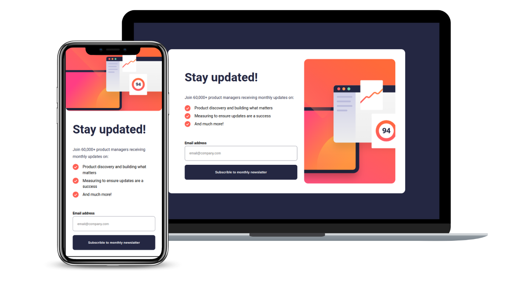

<h1 align='center'>Newsletter</h1>

    <a  href='#-tecnologias' > Tecnologias</a>&nbsp;&nbsp;&nbsp;|&nbsp;&nbsp;&nbsp
     <a  href='#-projeto' > Projeto</a>&nbsp;&nbsp;&nbsp;|&nbsp;&nbsp;&nbsp
      <a  href='#-layout' > Layout</a>&nbsp;&nbsp;&nbsp;|&nbsp;&nbsp;&nbsp
       <a  href='#-licença' > Licença</a>

    

 

    

##  🔧 Tecnologias
- NextJs
- Typescript
- CSS
- Redux/toolkit
- Git e Github
- Mockit

## 💻 Projeto

É um projeto desenvolvido com base no challenge  - Newsletter - do site [https://www.frontendmentor.io/](https://www.frontendmentor.io/) 

## :ballot_box_with_check: Licença
Esse projeto está sob licença MIT